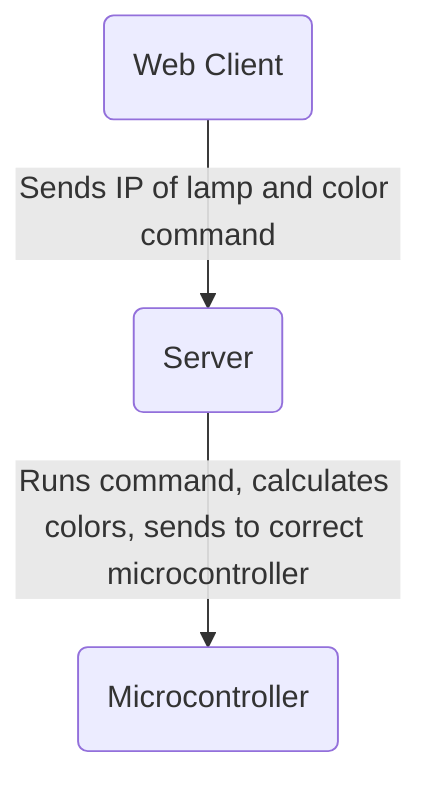

# I Love Lamp

A pet project for creating a programmable LED strip of 60 LEDs in a vertial lamp.

Raspberry Pi Picos are used to controll the light strips. They are a thin client
that receives a stream of led color values. This project includes a Node server
that is the lighting engine, and communicates with the Picos. It can also accept
commands from a Web client.

Using:

- Raspbery Pi Pico
- SK6812 RGBW LED strip

TODO:

- [ ] Update tests in engine from vitest since it's isn't in the vite project anymore
- [ ] Env variables for the PI and server to listen on the ips/ports I need them to

## Demo Video

// Soon.

## Arcitecture

## Color Engine

The `engine` directory contains the engine to caculate what colors to send to the
microcontroller. It's a layer based system using generator functions to calculate
the next 'tick' or frame.

TODO:

- [ ] Give generater functions the actual time since last tick to mainatin better timing if there are network slowdowns or hickups.

## Pi

This `pi` directory holds the micropython code to build a UDP client to recieve
LED colors as byte data and to push it to the LED strip.

The client is very thin ATM, only taking in a byte array of LED colors to push to the
LED strip. Future iterations might include having the color engine run locally, so
one doesn't need a server to render animations. My inital venture into MicroPython
made this difficult to achieve with desired performance.

## Server

This is the server for that pushs UDP packages to the microcontrollers.
