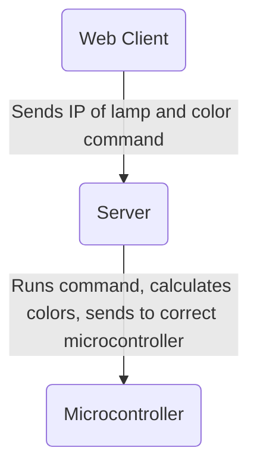

I Love Lamp
=====================

A pet project for creating a programmable LED strip of 60 LEDs in a vertial lamp.

Raspberry Pi Picos are used to controll the light strips.  They are a thin client
that receives a stream of led color values.  This project includes a Node server
that is the lighting engine, and communicates with the Picos.  It can also accept
commands from a Web client.

## Demo Video

// Soon.

## Arcitecture

